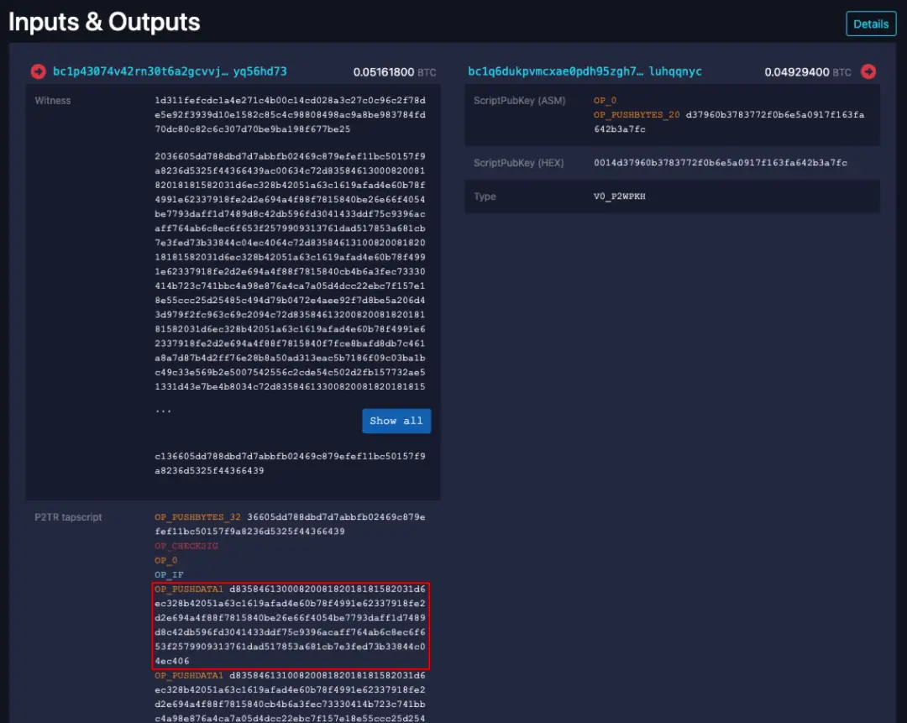
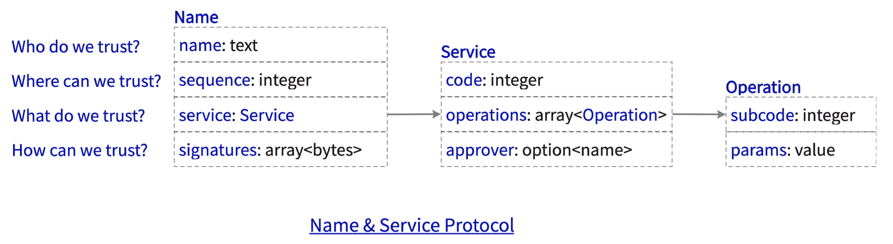

# Name & Service Protocol

> This document specifies a data structure based on [RFC8949 CBOR][cbor] for carrying next-generation Name and Service information on Bitcoin network, which is a open, decentralized, public, and trusted infrastructure for building the Web3 ecosystem.

本文档基于 CBOR 协议 [RFC8949][cbor]，定义了一种在比特币网络上承载下一代 Name & Service 信息的数据结构，Name & Service 是用于构建 Web3 生态系统的开放、去中心化、公开可信基础设施。

比特币网络拥有最强的共识，在原本的金融价值之外，它的 Taproot 脚本机制（铭文）可以用于承载更多价值信息。

NS（Name & Service 的简称）协议定义了一种可信数据体系，比特币网络用于承载这个可信数据体系的信任根，NS-Indexer 索引器则从比特币网络上提取这些数据，为上层应用提供可信数据服务。任何人都可以往比特币网络上写入 NS 协议数据，也可以运行 NS-Indexer 索引器查询可信数据。

## Overview

### 协议介绍

简单来说，Name Protocol 名称协议在比特币网络上创建了一个名为 `name` 的数据库，任何人都能读这个数据库，但只有持有对应 `public_key` 公钥的人才能写数据库。Service Protocol 服务协议则定义了数据库的数据模型，只有通过数据模型验证的数据才能被写入，这是一个开放的、去中心化的、公开可信的数据库。

比如，基于 NS 协议，Alice 可以进行：
1. 基于 `0` 号服务协议用一组公钥声明对 `alice` 名称的所有权，此后，Alice 用该名称在比特币链上进行其它行为都需要用公钥验证。当然，在比特币网络上，声明是先到先得，如果 `alice` 已被他人声明，Alice  就无法声明了。
2. 基于 `1` 号服务协议添加一组 [RFC9052 COSE][cose] 公钥，这是由 Alice 完全控制的 PKI，可用于比特币链下的其它互联网行为验证。比如作为 Alice 邮件的验证公钥，作为 Alice 网站的证书公钥等。
3. 基于 `2` 号服务协议添加 Alice 的个人公开信息、社交媒体账号信息等。
4. 基于 `3` 号服务协议添加 Alice 的钱包收款地址，或者网站 IP 信息，其他用户通过 NS-Indexer 可以查询 `alice` 的网站 IP 并访问。

还可以定义其它服务协议，如 NFT、RWA、DAO 等，标准服务协议可以更高效地引导服务提供者（即应用）和用户共建 Web3 生态系统。

第一个 NS 铭文可以在 https://mempool.space/tx/8e9d3e0d762c1d2348a2ca046b36f8de001f740c976b09c046ee1f09a8680131 看到，该交易包含了36个 NS 铭文：



一个 NS 铭文的数据结构如下：



### 协议实现

- ns-protocol: https://github.com/ldclabs/ns-rs/tree/main/crates/ns-protocol
- ns-indexer: https://github.com/ldclabs/ns-rs/tree/main/crates/ns-indexer
- ns-inscriber: https://github.com/ldclabs/ns-rs/tree/main/crates/ns-inscriber

### NS 协议的 CBOR 数据预览

NS 协议的数据结构是基于 CBOR 的，CBOR 是一种轻量级的二进制数据格式，它的数据结构类似 JSON，但是比 JSON 更高效，是 JSON 的超集。NS 协议使用了 [53 号 CBOR Tag](./cbor-dns-tag-53.md)（53 是 DNS 服务默认端口）。

第一个NS铭文的数据包如下（可以在 https://cbor.me/ 做可视化解析）:
```
d8358461300082008182018181582031d6ec328b42051a63c1619afad4e60b78f4991e62337918fe
2d2e694a4f88f7815840be26e66f4054be7793daff1d7489d8c42db596fd3041433ddf75c9396aca
ff764ab6c8ec6f653f2579909313761dad517853a681cb7e3fed73b33844c04ec406 // 114 bytes
```

Diagnostic notation:
```
53([           // cbor tag 53, quadruple in array
  "0",         // name: "a", UTF-8 string
  0,           // name's updating sequence, unsigned integer, 0 is the first sequence
  [            // name's service payload, two-tuples or triple in array
    0,         // service code, unsigned integer, 0 is the native Name service
    [          // updating operations, array
      [        // first operation, two-tuples in array
        1,     // operation subcode
        [      // operation params, struct defined by service protocol in cbor schema
          [    // first param: here is ed25519 public keys list, indicates the holder of the Name "a"
            h'31d6ec328b42051a63c1619afad4e60b78f4991e62337918fe2d2e694a4f88f7'
          ]
        ]
      ]
    ]
  ],
  [            // signatures array
    h'be26e66f4054be7793daff1d7489d8c42db596fd3041433ddf75c9396acaff764ab6c8ec6f653f2579909313761dad517853a681cb7e3fed73b33844c04ec406'
  ]
])
```
这个铭文数据的 `name` 是文本 `"0"`，`sequence` 是 `0`，`service` 区服务协议 `code` 是 `0`，包含一个操作，其 `subcode` 是 `0`，`params` 则是公钥数组，包含了一个 Ed25519 公钥 `31d6ec...88f7`，表明该公钥控制了名称 `"0"`。

## Name Protocol

如上图所示，名称协议是一个四元组，由长度为4的 CBOR 数组表示，分别是 `name`、`sequence`、`service` 和 `signatures`：
+ `name`：名称，是一个1到64字节的 UTF-8 字符串，但不能是大写字符、标点符号、分隔符、字符标记、符号、控制符等，验证逻辑详见 [ns-protocol 源码](https://github.com/ldclabs/ns-rs/blob/30db5871b6c0e5706e249c133aa7663c441f3c2d/crates/ns-protocol/src/ns.rs#L138)。
+ `sequence`：名称的更新序列号，是一个无符号整数，首次声明名称所有权时为 `0`，每次更新名称状态都会递增 `1`。
+ `service`：名称的服务负载区，详见服务协议。
+ `signatures`：数据包签名区，是一个签名数组，签名的内容为 `[name, sequence, service]` 三元组，签名逻辑详见 [ns-protocol 源码](https://github.com/ldclabs/ns-rs/blob/30db5871b6c0e5706e249c133aa7663c441f3c2d/crates/ns-protocol/src/ns.rs#L201)，所要求的签名数量由 `0` 号服务协议定义。

## Service Protocol

如上图所示，服务协议是一个二元组或三元组，由长度为2或3的 CBOR 数组表示，分别是 `code`、`operations` 和可选的 `approver`：
+ `code`：服务协议代号，是一个无符号整数，用于标识服务协议的类型，目前已实现了 `0` 号 Name Service 名称服务协议。计划中，`1` 号是 PKI Service 公钥服务协议，`2`号是 Profile Service 个人信息协议，`3` 号是 DNS Service 域名协议，其它服务协议由 NS 社区提案定义。
+ `operations`：服务状态操作区，是长度至少为1的 `Operation` 数组，即名称的一次更新可以包含同一服务下的多个操作。`Operation` 则是一个二元组，由 `subcode` 和 `params` 组成，`subcode` 是操作子码，`params` 是 CBOR 格式的操作参数，由 CBOR Schema（基于 [cbor-typeof-tag]）定义，它们的具体含义由服务协议定义。
+ `approver`：可选的服务数据审批人，如果提供，它应该是一个已声明的 `name`，审批人应该按照名称协议的描述对数据包进行签名，NS-Indexer 索引器会验证该签名。`approver` 用于需要服务提供方和用户共同确认的可信数据场景，比如数字签证，服务提供方是某个国家机构，用户是某个人，服务提供方和用户都需要对数据包进行签名，才能确认这个签证数据是可信的。

需要注意的是，往比特币网络写入数据成本较高，并且是公开的，服务方和用户只应该把最核心的、需要公开的数据写入链上。更多业务数据应该由链下的服务提供方和用户自行存储，NS-Indexer 索引器只负责提供链上可信数据的查询验证服务。

比如域名场景下，`name` 实际相当于顶级域名，用户可以把该顶级域名的权威 Nameserver 解析记录到链上，并且可能需要域名服务提供方作为 `approver` 审批人，子域名解析则由域名服务提供方负责。这样，用户可以通过NS-Indexer 索引器查询到域名的权威 Nameserver，然后再去权威 Nameserver 查询子域名的解析记录，并且子域名解析记录也是可以由 `1` 号 PKI 服务的公钥来验证的。用户对域名拥有绝对控制权，不但可以彻底解决域名劫持问题，还可以实现域名的去中心化，域名服务提供方也可以是多个，用户可以自由选择。

### `0` 号服务协议：Name Service
`0`号服务协议是服务于 NS 自身的协议，它定义了名称的所有权声明和更新操作，以及名称状态数据的验证。

| Subcode | Params            | Description                                    |
| ------- | ----------------- | ---------------------------------------------- |
| `0`     | `null`            | 最轻量的续约操作，仅更新 sequence 和状态时间   |
| `1`     | `PublicKeyParams` | 确认新的公钥数组，即声明所有权                 |
| `2`     | `PublicKeyParams` | 声明新的公钥数组，即允许控制权转移到这组新公钥 |

**`0`号操作及名称所有权有效期：**

虽然比特币网络铭文记录的数据是永久了，但 NS 协议定义的名称所有权并不是永久的，协议定义了名称失效时间 `NAME_STALE_SECONDS` 为365天，过期时间 `NAME_EXPIRE_SECONDS` 则为 `NAME_STALE_SECONDS` 之后的180天。

如果用户的名称在365天内没有更新操作，则处于失效状态——NS-Indexer 索引器对该名称的数据验证将标记为失败，如果再过180天还是没有任何更新操作，则该名称过期，其他用户可以声明该名称的所有权。

用户对名称的任何更新操作都会延续名称的有效期，最轻量的操作就是 `0` 号服务协议下的 `0` 号操作。

注意，时间以比特币区块的 `block_time` 为准。

**`PublicKeyParams` 定义：**
在 rust 源码中定义如下：
```rs
pub struct PublicKeyParams {
    pub public_keys: Vec<Vec<u8>>,
    pub threshold: Option<u8>, // default to public_keys.len()
    pub kind: Option<u8>,      // default to 0: ed25519
}
```
用 CBOR 描述则为一元、二元或三元组：
+ `public_keys`：公钥数组，每个公钥是一个字节数组，建议不超过5个公钥，多签建议使用3或4个公钥。
+ `threshold`：可选的多签阈值声明，如果提供则必须小于等于 `public_keys` 的长度，默认为 `public_keys` 的长度。
+ `kind`：可选的公钥类型声明，目前只支持 `0` 号 `ed25519` 公钥。

NS 协议有4种阈值验证 [ThresholdLevel](https://github.com/ldclabs/ns-rs/blob/30db5871b6c0e5706e249c133aa7663c441f3c2d/crates/ns-protocol/src/ns.rs#L62)，分别是：
- Single - 单签名验证，只要有一个签名验证成功即通过，使用场景如：确认某用户是名称持有者之一。
- Default - 默认多签验证，需要有 `threshold` 数量的签名验证成功才通过，一般名称状态更新使用该验证，`0-0` 号操作使用该值验证。
- Strict - 严格多签验证，需要有 `threshold + 1`（但不超过公钥数量）数量的签名验证成功才通过，`0-2` 号操作使用该值验证。
- All - 全签名，需要全部公钥签名验证成功才通过，`0-1` 号操作使用该值验证。需要注意的是，这里的全部公钥是新所有者的全部公钥。

比如名称 `"x"` 声明了4个公钥，阈值为2，那么：
- 某些服务提供方只需要单签名验证，任何1/4公钥签名验证成功即可；
- `"x"` 更新其它服务协议时，NS-Indexer 会使用默认多签验证，需要2/4公钥签名才验证成功；
- `"x"` 要更新公钥数组（如转移所有权）发起 `0-2` 号操作时，NS-Indexer 会使用严格多签验证，需要3/4个公钥签名才验证成功；
- `"x"` 持有人声明所有权 `0-1` 号操作，NS-Indexer 会使用全签名验证，需要4个公钥签名才验证成功。

又比如名称托管场景下，最合适的设置是3个公钥，其中用户持有2个公钥，托管商持有1个公钥，阈值为1，那么：
- 用户或者托管商能发起任何常规更新操作，如名称续期；
- 需要转移所有权时，就必须有用户参与了，托管商单方面无法声明新的公钥数组；
- 即使某一个公钥丢失了，用户可以利用还有效的两个公钥签发 `0-2` 号操作声明新公钥数组，再用全部新公钥签发 `0-1` 号操作确认新公钥数组，这两个操作可以在一个铭文请求中完成。

除了 `threshold` 阈值机制，NS 协议也天然支持 [FROST] 阈值签名验证，FROST 生成多方签名的流程相对复杂。

### `1` 号服务协议：PKI Service（TODO）
### `2` 号服务协议：Profile Service（TODO）
### `3` 号服务协议：DNS Service（TODO）

## NS-Indexer State（TODO）

https://github.com/ldclabs/ns-rs/blob/main/crates/ns-protocol/src/state.rs

[cbor]: https://datatracker.ietf.org/doc/html/rfc8949
[cose]: https://datatracker.ietf.org/doc/html/rfc9052
[cbor-typeof-tag]: https://github.com/cbor-schema/cbor-typeof-tag
[FROST]: https://github.com/ZcashFoundation/frost
